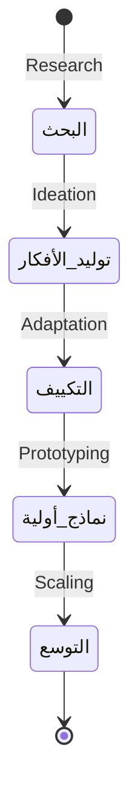

# 01. الملخص التنفيذي والأهداف الاستراتيجية للمشروع
## مشروع رسم خريطة شاملة وديناميكية لمنظومة الابتكار في اليمن (Tender: DO-DRA-09-2026)

---

## 📌 بطاقة التعريف بالمشروع (Project Profile)

| البند | التفاصيل |
| :--- | :--- |
| **اسم المشروع بالكامل** | خريطة شاملة وديناميكية وسهلة الاستخدام لمنظومة الابتكار في اليمن <br> *(A comprehensive, dynamic, and user-friendly map of the innovation ecosystem in Yemen)* |
| **رقم المناقصة (Tender No.)** | **DO-DRA-09-2026** |
| **الجهة المالكة والمنفذة** | منظمة ديفرستي (Diversity Organization) - قائدة مجموعة عمل الابتكار في اليمن |
| **الجهة المانحة (Funder)** | الائتلاف الهولندي للإغاثة (Dutch Relief Alliance - DRA) |
| **عملة العطاء والتعاقد** | الدولار الأمريكي (USD) |
| **تاريخ بدء الإعلان** | 2026/06/02 |
| **تاريخ الإغلاق النهائي** | 2026/06/18 |

---

## 🌍 السياق العام للمشروع (Context & Background)

تُصنف الأزمة الإنسانية في اليمن كواحدة من أكثر الأزمات تعقيداً وتشابكاً على مستوى العالم، حيث يعتمد ملايين السكان بشكل مباشر على المساعدات الإنسانية للبقاء على قيد الحياة. في ظل هذا الواقع المتدهور والصعب، يبرز **الابتكار** كركيزة أساسية واستراتيجية تتبناها برامج الاستجابة المشتركة في اليمن (YJR) لتحقيق الأهداف التالية:
* **تحسين جودة وكفاءة العمل الإنساني:** عبر إيجاد طرق مبتكرة لتقديم المساعدات وخفض التكاليف التشغيلية.
* **تطوير حلول مستدامة:** الابتعاد التدريجي عن الإغاثة قصيرة الأجل نحو تمكين المجتمعات المحلية ودعم مرونتها وتنميتها المستدامة.
* **تمكين المجتمعات المحلية:** إشراك الفئات المستهدفة في تصميم الحلول وتجربتها لضمان ملاءمتها للسياق المحلي.

---

## ⚠️ المشكلة والفجوات الحالية (Problem Statement & Gaps)

على الرغم من الاعتراف المتزايد بأهمية الابتكار، إلا أن منظومة الابتكار في اليمن تواجه فجوات حادة تعيق تطورها، وتتلخص في النقاط التالية:

```
┌────────────────────────────────────────────────────────────────────────┐
│                        الفجوات الرئيسية في منظومة الابتكار              │
├────────────────────────────────────────────────────────────────────────┤
│ 1. تشتت المعرفة: غياب مصدر موحد ومحدث للمعلومات حول المبادرات.        │
│ 2. غياب قاعدة بيانات مشتركة: صعوبة معرفة الفاعلين ونشاطاتهم وتخصصاتهم.│
│ 3. ضعف الرؤية المشتركة: عدم وضوح شبكات العلاقات والتعاون القائم.       │
│ 4. غياب مؤشرات موحدة: عدم وجود إطار لقياس نضج الابتكار محلياً.         │
│ 5. عدم وجود منصة تفاعلية: غياب أداة لاستكشاف الفرص والفجوات جغرافياً.   │
└────────────────────────────────────────────────────────────────────────┘
```

---

## 🎯 أهداف المشروع الأساسية (Project Objectives)

### 1. الهدف العام للمهمة (Overall Objective)
تطوير خريطة تفاعلية شاملة وديناميكية وسهلة الاستخدام لمنظومة الابتكار في اليمن، بهدف تمكين الفاعلين المحليين والدوليين (الجهات المانحة، صناع القرار، المنظمات المنفذة) من فهم البنية الحالية للابتكار، وتحديد الفرص والشركاء المحتملين، وكشف مواطن الخلل والتداخل الجغرافي والقطاعي لتوجيه الدعم بكفاءة.

### 2. الأهداف التفصيلية (Specific Objectives)
* **المصادقة على الشروط المرجعية للمنظومة:** مراجعة واعتماد معايير ومؤشرات شمول الفاعلين واستبعادهم.
* **تصنيف الفاعلين وربطهم بدورة الابتكار:** تحديد الفاعلين في القطاعات الثلاثة وتصنيفهم بناءً على مراحل الابتكار المتعارف عليها عالمياً.
* **تعزيز التشبيك وبناء الدليل التفاعلي:** تسهيل الوصول للشركاء عبر دليل تفاعلي ثنائي اللغة.
* **تطوير أدوات ومنهجية جمع البيانات:** تصميم استبيانات إلكترونية مرنة وحزم مقابلات نوعية لجمع البيانات وتدريب فرق الميدان.
* **تطوير لوحة التحكم التفاعلية (Dashboard):** بناء لوحة بيانات مرئية وديناميكية تعرض الخرائط الجغرافية والتحليلات الإحصائية للمنظومة.
* **تنظيم ورشة عمل إطلاق النموذج الأولي:** تيسير ورشة تشاورية بمشاركة الشركاء لمراجعة النموذج وتحديد العلاقات والشبكات.
* **بناء القدرات والاستدامة:** تدريب فريق منظمة ديفرستي على إدارة وتحديث لوحة البيانات بشكل دوري لضمان استدامة النظام البيئي.

---

## 🏢 القطاعات المستهدفة في المنظومة (Target Sectors)
تشمل عملية رسم الخريطة الفاعلين عبر ثلاثة قطاعات رئيسية في اليمن لضمان شمولية التحليل:
1. **القطاع الحكومي والعام (Public Sector):** المؤسسات الأكاديمية والبحثية، مراكز التطوير والتدريب الحكومية، والهيئات الرسمية ذات العلاقة.
2. **القطاع الخاص (Private Sector):** الشركات التجارية، حاضنات ومسرعات الأعمال الخاصة، المستثمرين، رواد الأعمال، والشركات الناشئة.
3. **منظمات المجتمع المدني والقطاع الإنساني (Civil Society & NGOs):** المنظمات غير الحكومية المحلية والدولية، المبادرات الشبابية والمجتمعية، والشبكات التطوعية.

---

## 🔄 مراحل دورة الابتكار المعتمدة للتصنيف (Innovation Stages)
سيتم تصنيف جميع الجهات الفاعلة المدرجة في قاعدة البيانات وفقاً لدورها ومساهمتها في دورة الابتكار المعتمدة دولياً، والتي تتكون من 5 مراحل رئيسية:



1. **البحث (Research):** دراسة الاحتياجات وتحديد المشاكل وجمع الأدلة الأساسية.
2. **توليد الأفكار (Ideation / Invention):** ابتكار الحلول وتوليد أفكار جديدة لمعالجة المشاكل المحددة.
3. **التكييف والملائمة (Adaptation):** تكييف الحلول القائمة عالمياً أو إقليمياً لتتناسب مع السياق المحلي لليمن.
4. **تطوير واختبار النماذج الأولية (Prototyping):** تجربة الحل على نطاق ضيق وقياس فاعليته وجدواه.
5. **التوسع والاستدامة (Scaling):** تعميم الحلول الناجحة وتوسيع نطاق تطبيقها لتصل إلى عدد أكبر من المستفيدين.

---
> [!TIP]
> لفهم المواصفات التقنية وتفاصيل الحزمتين، يرجى الانتقال إلى الملف التالي: [02. المواصفات الفنية ومتطلبات لوحة البيانات](file:///e:/Sharoobi%20workspace/YJR-Innovation-ecosystem-TOR/02_Technical_Specifications_and_Dashboard_Requirements.md).
