# 04. دليل تقديم المقترحات ومعايير التقييم
## متطلبات التقديم، الأهلية، معايير التحكيم الفني والمالي، والجدول المالي للدفعات

يحدد هذا الملف الإرشادات الكاملة التي يجب على الاستشاريين أو الشركات الاستشارية الالتزام بها عند تقديم عروضهم لمناقصة رسم خريطة الابتكار في اليمن.

---

## 🚫 معايير أهلية الاستشاري (Eligibility Criteria)

تُستبعد العروض تلقائياً ولا يُعتبر الاستشاري مؤهلاً للتقديم في الحالات التالية:
1. **الأنشطة غير القانونية:** الإدانة بارتكاب أنشطة غير قانونية، أو ممارسات فاسدة، أو سلوك غير مهني.
2. **سلوك مهني جسيم:** صدور أحكام قضائية بالإدانة بارتكاب سوء سلوك مهني جسيم.
3. **تزوير أو تضليل المعلومات:** ثبوت تقديم معلومات مضللة أو تفسير خاطئ وجسيم للمعلومات في وثائق التقديم.
4. **قوائم الإرهاب:** إدراج اسم الاستشاري أو أي من أعضاء فريقه في قوائم مكافحة الإرهاب المحلية أو الدولية.

---

## 📝 متطلبات التقديم والملف المطلوب (Application Requirements)

يجب على المتقدمين إرسال ملف متكامل يحتوي على الوثائق التالية:
* **التسجيل:** التسجيل عبر الرابط الإلكتروني المرفق بالإعلان الأصلي.
* **السيرة الذاتية (CV):** سيرة ذاتية محدثة للاستشاري الرئيسي وأعضاء الفريق المقترحين.
* **المقترح الفني (Technical Proposal):** يتضمن المنهجية المقترحة بالتفصيل، أدوات العمل المخطط استخدامها، خطة العمل التفصيلية والجدول الزمني، وإطار التحليل المقترح.
* **المقترح المالي (Financial Proposal):** مقترح مالي تفصيلي ومسعر بالدولار الأمريكي (USD) ومتوافق مع خطة العمل المقترحة.
* **سابقة الأعمال والخبرات (Portfolio):** تقديم نماذج لأعمال سابقة تتضمن **مشروعين (2) على الأقل** في مجالات مشابهة (رسم خرائط المنظومات، لوحات البيانات التفاعلية) مع إرفاق أرقام جهات تواصل مرجعية (Contactable References) للتحقق.
* **الشهادات الأكاديمية والمهنية:** نسخ من الشهادات الأكاديمية والمهنية ذات الصلة لأعضاء الفريق (إن وجدت).

> [!IMPORTANT]
> **طريقة تقديم العطاء الفعلي:**
> يتم تسليم العروض في **ظرف مغلق ومختوم** إلى مكتب المنظمة الرئيسي في محافظة عدن بالعنوان التالي:
> **عدن - مدينة إنماء القديمة - خلف المدرسة البريطانية**.
>
> **الموعد النهائي لاستلام العطاءات:**
> سيتم إغلاق باب استقبال العطاءات رسمياً في يوم **الخميس، 18 يونيو 2026**. لن يتم النظر في أي عروض تقدم بعد هذا التاريخ.

---

## ⚖️ معايير تقييم العروض والترسية (Evaluation Criteria)

تخضع العروض لتقييم دقيق مقسم إلى شقين: **عرض فني بوزن 70%**، و**عرض مالي بوزن 30%**. ويتم تقييم كل حزمة بشكل مستقل (يجوز الترسية الجزئية):

### 1. معايير تقييم الحزمة الأولى (Lot 1): جمع البيانات ورسم المنظومة

| معيار التقييم الفني | تفاصيل المعيار | الوزن النسبي |
| :--- | :--- | :---: |
| **الخبرة الفنية في رسم المنظومات وجمع البيانات** | سابقة الأعمال في تصميم الدراسات وتصنيف الجهات الفاعلة في السياق اليمني أو الإنساني. | **30%** |
| **المنهجية وخطة العمل** | جودة المنهجية المقترحة لجمع البيانات، وتوافقها مع طبيعة المهمة والجدول المالي. | **20%** |
| **مؤهلات وخبرات الفريق** | الخبرة التراكمية للفريق الميداني والبحثي المقترح وقدرتهم الفنية. | **10%** |
| **الجدول الزمني** | منطقية توزيع الأنشطة والالتزام بإنهاء المهمة في الوقت المحدد. | **10%** |
| **إجمالي التقييم الفني** | الحد الأدنى للقبول الفني هو **60% من التقييم الفني** للانتقال للتقييم المالي. | **70%** |
| **العرض المالي** | تقييم السعر الإجمالي للعرض المالي والقيمة مقابل المال (Value for Money). | **30%** |

### 2. معايير تقييم الحزمة الثانية (Lot 2): لوحة البيانات التفاعلية (Dashboard)

| معيار التقييم الفني | تفاصيل المعيار | الوزن النسبي |
| :--- | :--- | :---: |
| **الخبرة التقنية في اللوحات التفاعلية** | سابقة الأعمال في تطوير لوحات البيانات التفاعلية (Power BI/Tableau) والأنظمة البرمجية. | **30%** |
| **جودة التصميم وتجربة المستخدم (UX)** | القدرة على تصميم واجهات جاذبة، متجاوبة مع الهواتف، وداعمة للإنترنت الضعيف وثنائية اللغة. | **20%** |
| **خطة التطوير والدعم الفني** | وضوح خطوات التطوير، وخطة التدريب لفريق المنظمة وضمان الاستضافة والدعم الفني. | **10%** |
| **الجدول الزمني** | التزام الاستشاري بمراحل تسليم اللوحات التجريبية والنهائية بالتوازي مع جمع البيانات. | **10%** |
| **إجمالي التقييم الفني** | الحد الأدنى للقبول الفني هو **60% من التقييم الفني** للانتقال للتقييم المالي. | **70%** |
| **العرض المالي** | تقييم السعر الإجمالي المقترح وتكاليف الاستضافة والدعم الفني المدمجة. | **30%** |

---

## 💰 آلية وجدول الدفعات المالية (Payment Mechanism)

يتم صرف مستحقات الاستشاري المالي المتعاقد معه على **ثلاث دفعات مالية** مرتبطة بتسليم واعتماد المخرجات كالتالي:

```mermaid
gantt
    title جدول صرف الدفعات المالية للمشروع
    dateFormat  X
    axisFormat %d
    
    section الدفعات المالية
    الدفعة الأولى 30% :active, p1, 0, 10
    الدفعة الثانية 40% :crit, p2, 10, 25
    الدفعة الثالثة 30% :p3, 25, 35
```

* **الدفعة الأولى (30%):** تُصرف فور توقيع العقد رسمياً والموافقة على التقرير الافتتاحي وخطة العمل.
* **الدفعة الثانية (40%):** تُصرف عقب تسليم المسودة الأولية للمخرجات (Draft Deliverable) وعرض لوحة البيانات التجريبية في ورشة العمل التشاورية.
* **الدفعة الثالثة (30%):** تُصرف عقب تسليم كافة المخرجات النهائية المعتمدة والمصادقة عليها من قبل منظمة ديفرستي وفريق العمل، بما في ذلك تسليم قاعدة البيانات المنظمة، لوحة البيانات النهائية المستضافة، دليل المستخدم ثنائي اللغة، وإتمام دورة التدريب.

---

## 🔒 الملكية الفكرية وحفظ السرية (IP & Confidentiality)

* **ملكية المخرجات:** تعود الملكية الحصرية والكاملة لجميع مخرجات المشروع (تقارير، لوحات بيانات تفاعلية، قواعد بيانات، أدوات ومنهجيات) إلى **منظمة ديفرستي اليمن (Diversity Yemen)**، و**برنامج الاستجابة المشتركة لليمن (YJR)**، و**الائتلاف الهولندي للإغاثة (DRA)**.
* **الاستخدام غير المصرح به:** لا يحق للاستشاري أو الشركة الاستشارية استخدام أي من هذه المخرجات أو البيانات لأي أغراض أخرى خارج نطاق هذا العقد دون الحصول على إذن كتابي وصريح ومسبق من الجهات المالكة.
* **اتفاقية عدم الإفصاح (NDA):** يلتزم الاستشاري بتوقيع اتفاقية سرية وعدم إفصاح صارمة قبل مباشرة أي عمل أو الاطلاع على البيانات الداخلية.

---
> [!NOTE]
> يمثل هذا الدليل الإطار المالي والإداري الحاكم للمناقصة. يمكنك مراجعة الفهرس العام للمستندات في أي وقت عبر الرجوع إلى: [الملف الرئيسي README](file:///e:/Sharoobi%20workspace/YJR-Innovation-ecosystem-TOR/README.md).
