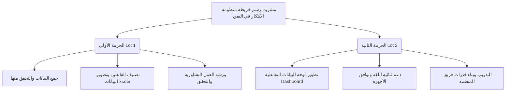

# 📋 دليل تحليل وثيقة الشروط المرجعية (TOR) لمنظومة الابتكار في اليمن
## مشروع رسم خريطة شاملة وديناميكية لمنظومة الابتكار الإنساني والاجتماعي (YJR)

مرحباً بك! لقد تم تحليل وثيقة طلب الخدمات الاستشارية المتعددة رقم **DO-DRA-09-2026** الصادرة عن **منظمة ديفرستي (Diversity Organization)** بالتعاون مع **الائتلاف الهولندي للإغاثة (DRA)** بكل عمق وتفصيل.

لضمان سهولة التصفح والوصول إلى كافة جوانب المشروع بأقصى درجات الاحترافية والعمق، تم تقسيم التوثيق إلى أربعة ملفات رئيسية مترابطة في هذا المجلد:

---

## 📂 خريطة ملفات التوثيق والتحليل

| اسم الملف | محتوى الملف ووصفه | روابط الوصول السريع |
| :--- | :--- | :--- |
| **01. الملخص التنفيذي والأهداف الاستراتيجية** | يغطي السياق العام للأزمة الإنسانية في اليمن، دور الابتكار في برنامج الاستجابة المشتركة (YJR)، الثغرات الحالية في النظام البيئي، والأهداف العامة والتفصيلية للمشروع. | [عرض الملف](file:///e:/Sharoobi%20workspace/YJR-Innovation-ecosystem-TOR/01_Executive_Summary_and_Project_Overview.md) |
| **02. المواصفات الفنية ومتطلبات لوحة البيانات** | يركز على التفاصيل التقنية الخاصة بالحزمتين (Lot 1 & Lot 2)، مواصفات لوحة البيانات (Power BI/Tableau)، متطلبات ثنائية اللغة، التوافق مع الهواتف الذكية والإنترنت الضعيف، وحزمة التسليم البرمجية. | [عرض الملف](file:///e:/Sharoobi%20workspace/YJR-Innovation-ecosystem-TOR/02_Technical_Specifications_and_Dashboard_Requirements.md) |
| **03. منهجية التنفيذ ومراحل المشروع والشركاء** | يستعرض المراحل الخمسة للمشروع وجدولها الزمني، خطة إشراك أصحاب المصلحة (الحكومة، القطاع الخاص، المجتمع المدني)، استراتيجيات الوصول للمناطق الصعبة، وأخلاقيات البحث وحماية البيانات (GDPR). | [عرض الملف](file:///e:/Sharoobi%20workspace/YJR-Innovation-ecosystem-TOR/03_Implementation_Methodology_and_Phases.md) |
| **04. دليل تقديم المقترحات ومعايير التقييم** | يشرح متطلبات التقديم بالتفصيل، معايير الأهلية، معايير التقييم الفني والمالي للحزمتين بشكل منفصل، آلية التعاقد، الدفعات المالية (30% - 40% - 30%)، والموعد النهائي للتقديم. | [عرض الملف](file:///e:/Sharoobi%20workspace/YJR-Innovation-ecosystem-TOR/04_Proposal_Submission_and_Evaluation_Guide.md) |

---

## 🎯 الهيكل العام للمشروع ومحاوره الأساسية

### 💡 نصائح استراتيجية عامة للمتقدمين:
1. **التقديم المجزأ أو الكامل:** يتيح الإعلان التقديم على حزمة واحدة (Lot 1 أو Lot 2) أو على الحزمتين معاً. التقديم على الحزمتين معاً يمنح ميزة التكامل المنهجي والتقني إذا كان الاستشاري يمتلك القدرات المطلوبة لكلا الجانبين.
2. **الالتزام بالموعد النهائي:** التقديم يجب أن يكون في ظرف مغلق يُسلم لمكتب المنظمة في عدن (إنماء القديمة - خلف المدرسة البريطانية) في موعد أقصاه **الخميس 18 يونيو 2026**.
3. **أخلاقيات البحث وحماية البيانات:** نظراً لحساسية السياق اليمني، يجب التركيز الشديد في المقترح الفني على تطبيق مبدأ "لا ضرر ولا ضرار" والامتثال لمعايير GDPR.

---
> [!NOTE]
> يمكنك فتح أي من الملفات أعلاه بالضغط على الروابط الخاصة بها للتعمق في التفاصيل. لقد تمت كتابة هذه المستندات باللغة العربية مع إبقاء المصطلحات التقنية باللغة الإنجليزية لضمان تطابقها مع الوثيقة الأصلية للعميل وبأعلى درجات الاحترافية.
